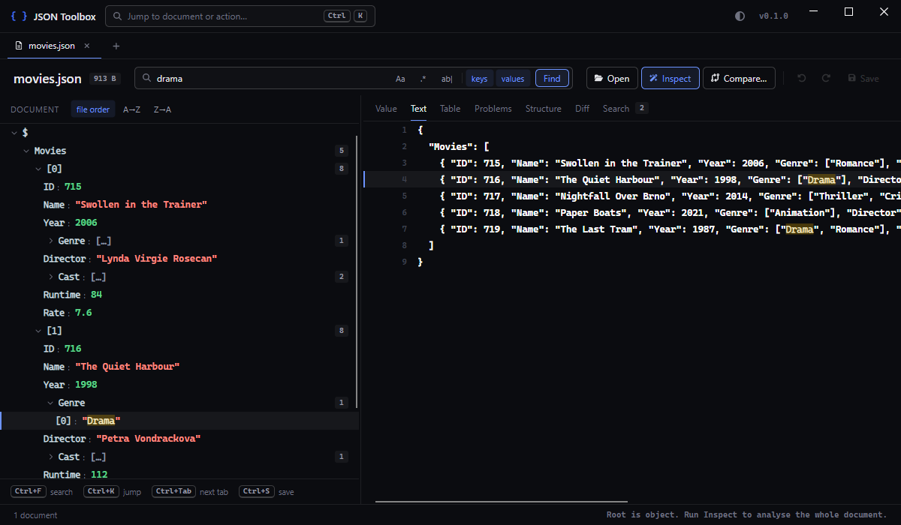

# JSON Toolbox

A desktop viewer for JSON files that are too large to open and too messy to trust.



It opens a multi-gigabyte file in milliseconds and browses it without ever loading it, because
every value is a byte offset into a memory-mapped file rather than an object in memory. And it
**inspects** rather than merely validates: alongside syntax errors it reports the values that
are perfectly legal JSON and will still be misread downstream — duplicate keys, integers too
large for a double, a field that is a number in a million records and a string in ten.

## Features

- **Tree and text, side by side.** Browse the structure as a tree, read the file as it is
  written, and click in either to select in the other.
- **Search** keys, values or both, as a substring, a regular expression or a whole word — with
  hits marked up in the tree, the results, the value pane and the text.
- **Inspect** the whole document for syntax errors explained in plain words and for the
  problems a validator will not find (see [What it finds](#what-it-finds)).
- **Structure profile:** the schema inferred from the data, with counts and byte shares per
  path — what is actually in this file, and why it is so large.
- **Table** view of any array of records, with sorting, filtering and columns inferred from the
  data. A million records in under a second.
- **Compare** two documents by structure, not by text: records are matched by key or
  identifier, so a moved record is a moved record and a changed field is one changed field.
- **Edit** values, keys and members, sort properties, undo, and save — without the file ever
  being rewritten in memory. Saving streams to a file beside the original and swaps it in.
- **JSON Lines** and other document sequences open as a list of their records; files with
  comments and trailing commas open leniently and say so.
- **Double-encoded JSON** — a document serialised into a string — is detected and shown
  decoded.
- **Pin a key** to see its value on every parent row, so an array of records can be scanned
  without opening any of them.
- A command palette (Ctrl+K), tabs, light and dark themes, drag and drop, and the build's
  version in the header.

## Install

Download the latest `JsonToolbox-<version>-win-x64.zip` from the
[releases page](https://github.com/TomasBouda/JsonToolbox/releases), unpack it anywhere and run
`JsonToolbox.exe`. It is self-contained: no .NET installation is needed. Each release ships
with a SHA-256 of the archive.

To run from source you need the [.NET 10 SDK](https://dotnet.microsoft.com/download):

```bash
dotnet run --project JsonToolbox.App
```

## Usage

Drop a file on the window, use **Open** (Ctrl+O), or pass paths on the command line — every
one of them opens in its own tab, so the toolbox can serve as the "Open with" handler for
`.json`. The panels beside the tree show the selected **Value**, the file as **Text**, an
array as a **Table**, the **Problems** and **Structure** found by Inspect, the **Diff** of a
comparison, and the **Search** results.

```bash
JsonToolbox data.json                        # open a file
JsonToolbox before.json after.json --compare # open both and land on the comparison
JsonToolbox --help
```

| Keys | Action |
| --- | --- |
| Ctrl+K | Command palette: jump to a document, a panel or an action |
| Ctrl+O | Open a file |
| Ctrl+F | Focus the search box |
| Enter in the search box | Search the document, or narrow the comparison |
| Ctrl+Tab | Next tab |
| Ctrl+W / middle click | Close the tab |
| Ctrl+Shift+T | Reopen the tab closed last |
| Ctrl+Z / Ctrl+Y | Undo / redo an edit |
| Ctrl+S | Save |
| Ctrl+Shift+L | Toggle light / dark |

Tabs can be dragged into a different order. Right-click a property to pin it, or a container to
sort it.

## What it finds

Syntax errors are explained rather than repeated from the parser — a trailing comma is reported
as a trailing comma, not as an unexpected `}` several characters later. The findings worth having
are the ones a validator will not give you:

| Code | Finding |
| --- | --- |
| `JE0002` | Duplicate key in one object — parsers disagree about which value wins |
| `JE0003` | Integer beyond 2^53, read differently by every consumer that decodes numbers as doubles |
| `JE0004` | Floating point value carrying more digits than a double can hold |
| `JE0005` | A path that is not consistently typed — `price` is a number 8 831 253 times and a string 177 times |
| `JE0006` | One object mixing `camelCase` and `snake_case` keys |
| `JE0007` | Keys that differ only by letter case, which case-insensitive consumers will merge |
| `JE0008` | `"null"`, `"undefined"` and friends written as text, where no null check will find them |
| `JE0011` | A field present in 999 of 1 000 records — optional by accident, not by design |
| `JE0012` | A property that looks like it holds a credential |
| `JE0013` | Double-encoded JSON: a string whose content is itself a document |

Findings are folded by rule and shape, so a million records with the same defect produce one
row with a count rather than a million rows.

## Performance

A 1.0 GB document of 8.8 million records, on an ordinary desktop:

| Operation | Time |
| --- | --- |
| Open the file | 3 ms |
| Expand a record 500 MB into the file | 0.2 ms |
| Full-text search across the whole document | 4.3 s (238 MB/s) |
| Full inspection, all rules | 11.8 s (87 MB/s) |
| Table over a 103 MB array of 1 M records | 0.8 s |
| One changed value in a pair of 300 MB files | 1.2 s |

Managed memory stayed at 6.7 MB throughout, and the UI thread was never blocked for longer
than 21 ms while a 300 MB file loaded.

## How it works

One forward scanner feeds every feature — indexing, search, inspection, comparison — so nothing
needs the document in memory. A node's children are indexed the first time it is expanded, from
a memory-mapped slice of exactly that node. Edits go into a piece table over the untouched
original, so an edit costs the same in a gigabyte as in a kilobyte, and the rest of the code
reads an edited document through the same interface as a file on disk.

The reasoning behind these and the other decisions that shape the code is in
[docs/DESIGN.md](docs/DESIGN.md).

```
JsonToolbox.Core          parsing, indexing, search, inspection — no UI dependency
JsonToolbox.App           Avalonia desktop application
JsonToolbox.Core.Tests
JsonToolbox.App.Tests
```

## Development

```bash
dotnet build
dotnet test
```

A release is a version tag: bump `VersionPrefix` in `Directory.Build.props`, then

```bash
git tag v0.2.0 && git push origin v0.2.0
```

and `.github/workflows/release.yml` builds, tests, publishes a trimmed self-contained `win-x64`
build and attaches it to a GitHub release. The tag must match the version, and the application
shows the version it was built with in its header. Every release gets a section in
`CHANGELOG.md`.

## Roadmap

- JSONPath and JMESPath queries
- JSON Schema validation
- Decoding base64, JWT, timestamps and URL encoding in place
- Three-way merge, and exporting a diff as a patch
- Redaction mode for sharing; type generation for C# and TypeScript
- Undo history surviving a save; sorting values larger than 64 MB; editing values too large to
  show as text
